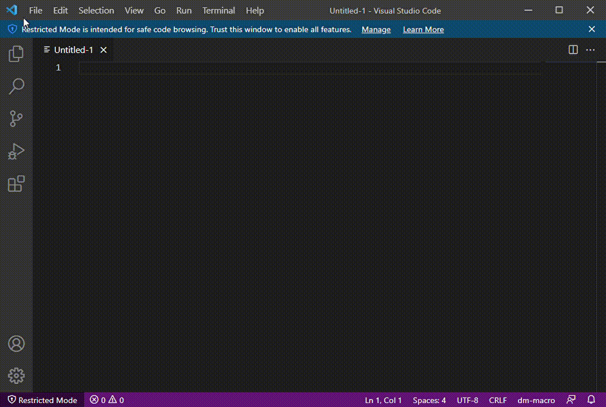

# vscode dm-macro
VS Code language support for Datamine RM Macro language

# Usage
Using dm-macro is simple. Open a macro file in VS Code and start typing. Here is a demo: 



# to install
First, install VS Code. Then, clone or copy this repository and copy the folder `dm-macro` 
in your local vscode extension folder. This is usually located at: 

```C:\Users\<your user name>\.vscode\extensions\```

or 

```~/.vscode/extensions/```
